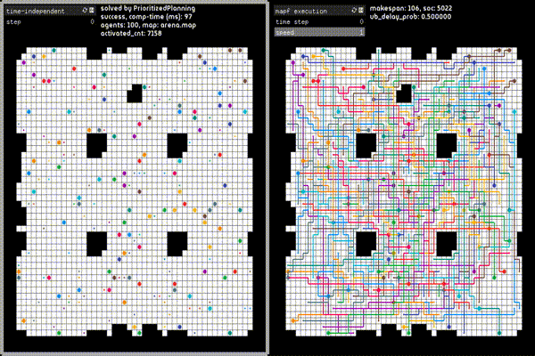

otimapp
===
[](LICENSE)

A simulator and visualizer used in a paper "Offline Time-Independent Multi-Agent Path Planning" (OTIMAPP).
It is written in C++(17) with [CMake](https://cmake.org/) (≥v3.16) build.
The repository uses [Google Test](https://github.com/google/googletest) and [the original library for 2D pathfinding](https://github.com/Kei18/grid-pathfinding) as git submodules.
The visualizer uses [openFrameworks](https://openframeworks.cc) and works only on MacOS.


| platform | status (public) | status (dev) |
| ---: | :--- |:--- |
| macos-10.15 |   |   |
| ubuntu-latest |  |  |


Please cite the following paper if you use the code in your published research:
```
@article{okumura2021offline,
  title={Offline Time-Independent Multi-Agent Path Planning},
  author={Okumura, Keisuke and Bonnet, Fran{\c{c}}ois and Tamura, Yasumasa and D{\'e}fago, Xavier},
  journal={arXiv preprint arXiv:xxxxxx},
  year={2021}
}
```


## Demo


4-tolerant solution planned by PP, execution on MAPF-DP

## Building

```sh
git clone --recursive https://github.com/Kei18/otimapp.git
cd otimapp
mkdir build
cd build
cmake ..
make
```

## Usage
### Planning
planed by PP, 4-tolerant solutions
```sh
./app -i ../instances/sample.txt -s PrioritizedPlanning -o ./plan.txt -v -f 4
```

### Execution
MAPF-DP, upper bound of delay probabilities is 0.5
```sh
./exec -i ../instances/sample.txt -p ./plan.txt -o ./exec.txt -v -u 0.5
```

### Help
You can find details and explanations for all parameters with:
```sh
./app --help
```
or
```sh
./exec --help
```

Please see `instances/sample.txt` for parameters of instances, e.g., filed, number of agents, time limit, etc.

### Output File

This is an example output of `../instances/sample.txt`.
Note that `(x, y)` denotes location.
`(0, 0)` is the left-top point.
`(x, 0)` is the location at `x`-th column and 1st row.
A position `(x, y)` are also represented as a single number `i = widht*y + x`.

- `plan.txt`

```txt
instance=../instances/sample.txt
agents=100
map_file=arena.map
seed=1
solver=PrioritizedPlanning
solved=1
unsolvable=0
comp_time=97
starts=(32,21),(40,4),(20,22),[...]
goals=(10,16),(30,21),(11,42),[...]
sum-of-path-length:3401
plan=
0:1061,1012,963,[...]
1:236,285,334,[...]
[...]
```

- `exec.txt`

```txt
// log from ./plan.txt
---
(copy of plan.txt)
---
// exec result
---
problem_name=MAPF_DP
plan=./plan.txt
ub_delay_prob=0.5
delay_probs=0.274407,0.296422,[...]
exec_succeed=1
exec_seed=0
emulation_time=3
activate_cnts=7158
makespan=106
soc=5022
result=
0:(32,21),(40,4),(20,22),[...]
1:(32,20),(40,5),(20,22),[..]
[...]
```

## Visualizer

### Building
It takes around 10 minutes.

#### macOS
```sh
bash ./visualizer/scripts/build_macos.sh
```

Note: The script of openFrameworks seems to contain bugs. Check this [issue](https://github.com/openframeworks/openFrameworks/issues/6623). I fixed this in my script :D


### Usage
```sh
cd build
../visualize.sh ./exec.txt
```

You can manipulate it via your keyboard. See printed info.


## Experimental Environment
[](https://github.com/Kei18/otimapp/releases/tag/v1.0)

Scripts for the experiments are in `exp_scripts/`.

## Notes
- Maps in `maps/` are from [Pathfinding Benchmarks](https://movingai.com/benchmarks/).
  When you add a new map, please place it in the `maps/` directory.
- The font in `visualizer/bin/data` is from [Google Fonts](https://fonts.google.com/).

## Licence
This software is released under the MIT License, see [LICENSE.txt](LICENCE.txt).

## Author
[Keisuke Okumura](https://kei18.github.io) is a Ph.D. student at the Tokyo Institute of Technology, interested in controlling multiple moving agents.
